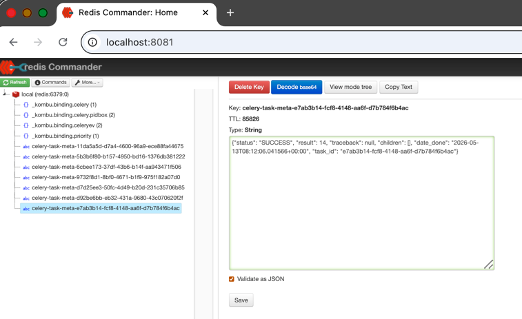
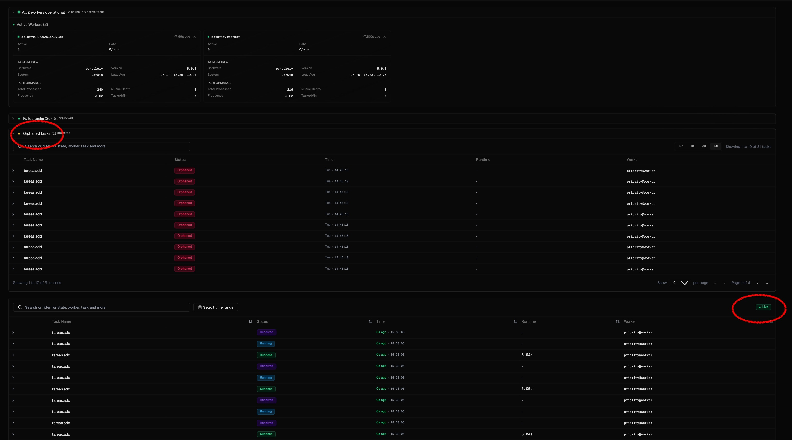
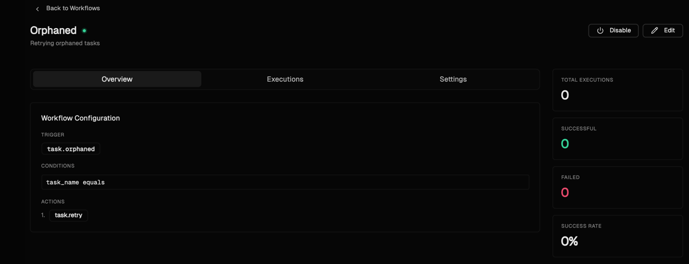
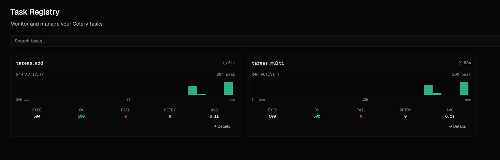

# POC: Celery Monitoring with Kanchi

There are 2 simpler examples for setting up a Celery queuing system before moving on to the final example with Kanchi monitoring:

#### **_Prerequisites_**:

 - Create a virtual environment and install the required packages:

    - PyPy3.9+ ❨v7.3.12+❩
    - Python ❨3.8, 3.9, 3.10, 3.11, 3.12, 3.13❩
    - Celery 5.5.x
    - Redis (as the message broker used in these examples)

  - Create and launch the docker compose: docker compose  up -d --pull always

  - For more details on how to set up the environment, please refer to the Celery site https://docs.celeryq.dev/en/latest/index.html

  
## 1- simple_example:

* execute the task to check the result:

         *  user@xxx simple_example % python -i tasks.py
               >>> add(9,5)
                ... Processing the sum...  wait 6 seconds, please
                ... Processing the sum...  wait 5 seconds, please
                ... Processing the sum...  wait 4 seconds, please
                ... Processing the sum...  wait 3 seconds, please
                ... Processing the sum...  wait 2 seconds, please
                ... Processing the sum...  wait 1 seconds, please
                ... 14  
    
  * To process this task through the worker, we need to run the worker in a separate terminal:

           * user@xxx simple_example % celery -A tasks worker --loglevel=info
    and then execute the task again in the first terminal to see the result being processed by the worker:

           * user@xxx simple_example % python -i tasks.py
              >>>   add.delay(3,4)
                 <AsyncResult: 8c797e4e-da05-4f2a-8536-f9072621e6050>
    we'll recibe the message with the task identifier, and then we can check the result of the task with the following command, since we have setup a backend to store the task result info

           * user@xxx simple_example % python -i tasks.py
              
              <AsyncResult: 8c797e4e-da05-4f2a-8536-f9072621e605> ---> esto se ejecutó en celery
              >>>   result= add.AsyncResult("8c797e4e-da05-4f2a-8536-f9072621e605")
              >>>   result.ready()
                True
              >>>   result.status
                'SUCCESS'
              >>>   result.get()
                7
              >>>   exit()
    we can also see the result of the task in Redis by accessing the location setup for the result's backend in our celery application, in this case is:  http://localhost:8081/
  
  * 
  

## 2- routing_example

In this case we have two different tasks, and 2 queues. We want each of these tasks to be processed by a different worker.
The procedure to execute the tasks is the same as in the previous example, but we need to specify the queue when we execute the task:

         * user@xxx routing_example % python -i tasks.py
            >>>  add.delay(3,4)
                <AsyncResult: 8c797e4e-da05-4f2a-8536-f9072621e6050>
            >>>  mul.delay(3,4)
                <AsyncResult: 8c797e4e-da05-4f2a-8536-f9072621e6050>

To check the workers we have to open 2 different terminals, and run the following command in each of them:

         * user@xxx routing_example % celery -A celery_app worker -Q priority -n priority@worker --loglevel INFO 
         * user@xxx routing_example % celery -A celery_app worker -l info 

Then we can check the result of each task as we did in the previous example, and see that they are being processed by different workers.

## 3- kanchi_example

Note: In this example, 'k8s-manifests' and 'scripts' folders are not necessary.

#### _References_: 
* https://kanchi.io/docs/getting-started/quickstart

* https://github.com/getkanchi/kanchi

#### Prerequisites:

* Install Poetry
* Node.js

First of all we need to start the containers for redis, kanchi and redis-commander with

* docker compose up -d --pull always

Execute the same tests explained in the example 2- routing_example.

Open the kanchi console: http://localhost:3000/

We can also access redis backend in http://localhost:8081/

By simply accessing the Dashboard, we can already see some of the key features that make Kanchi stand out over other solutions like Flower.

In addition, we can also create workflows to have any event under control

And observe some tasks performance details:

